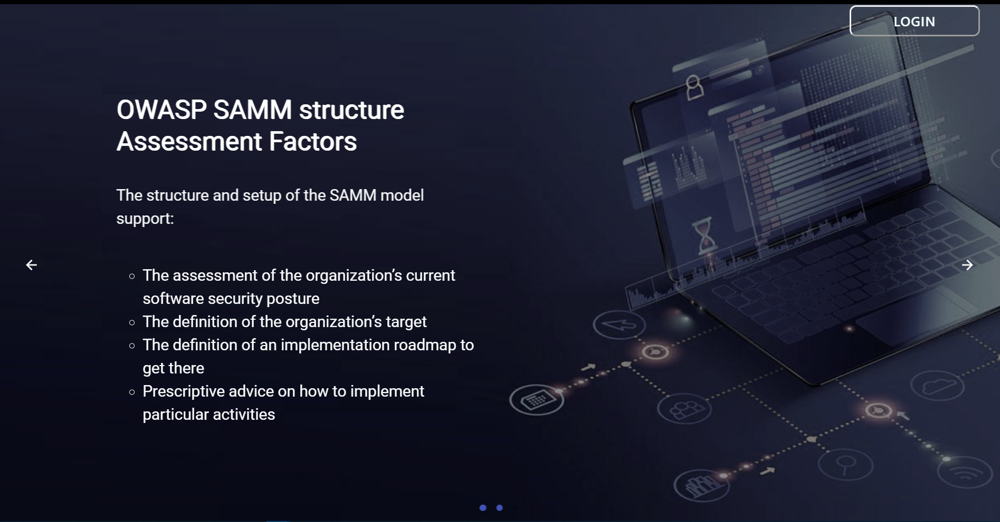
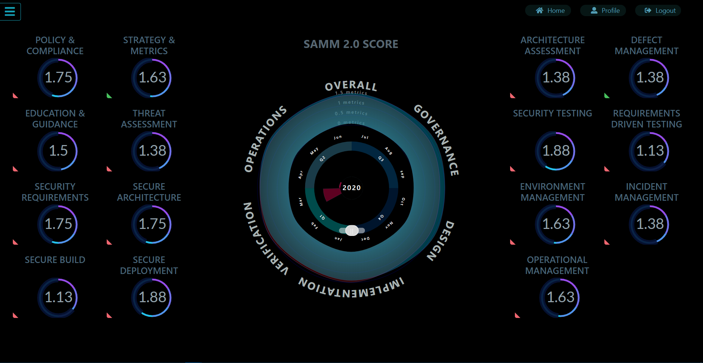
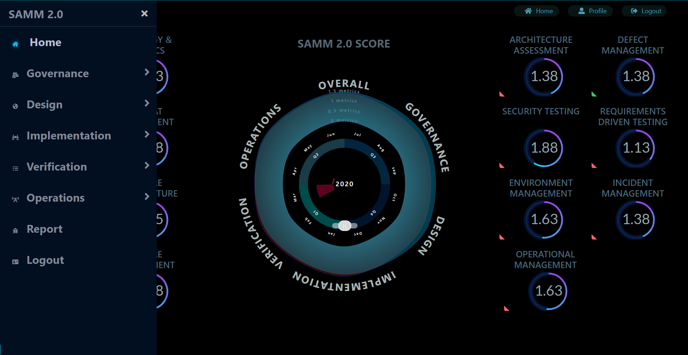
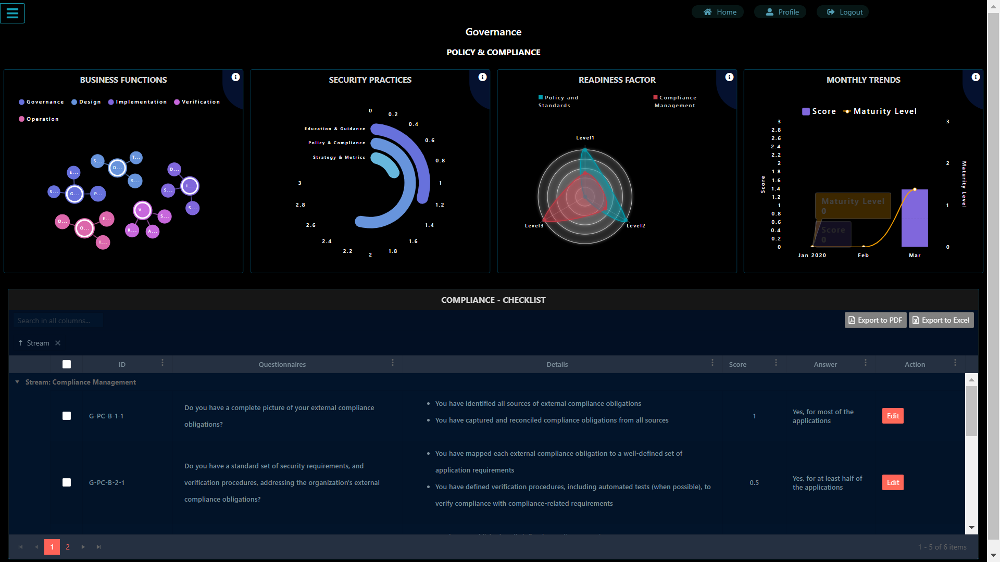
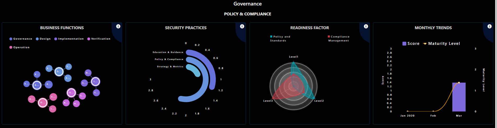
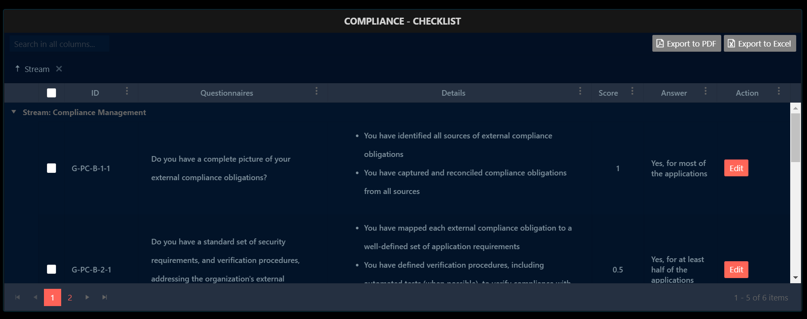
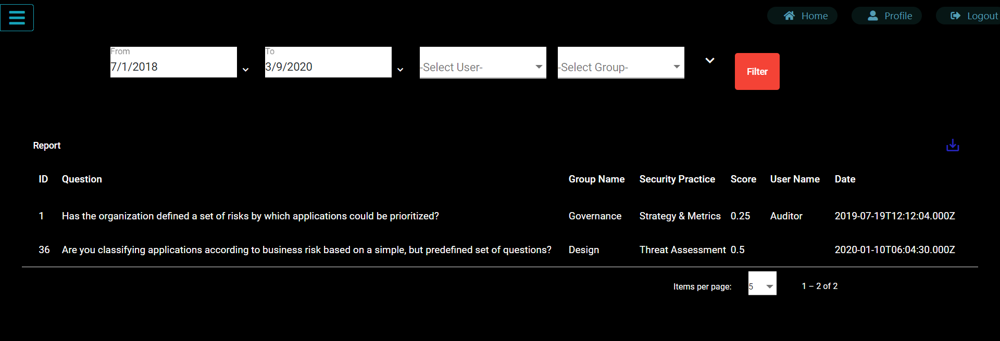
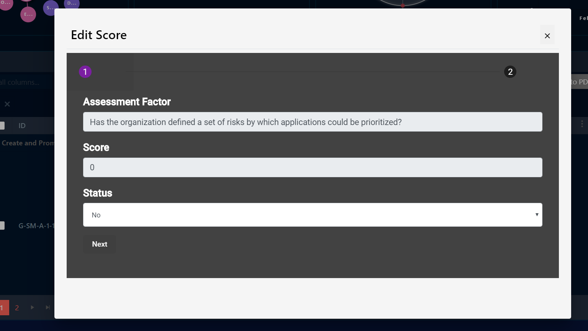

# OWASP SAMM 2.0

  
  
  
  
  
  
   
  

# SAMM

### Explanatory Video

### Login Page

### Home Dashboard

### Navigation Module

### Security Practice Section

### Score Panel

### Checklist Module

### Report Generation

### Edit Score Module

This project was generated with [Angular CLI](https://github.com/angular/angular-cli) version 8.3.19.

## Software Requirements

1) NodeJS: https://nodejs.org/en/download/
   a. Make sure your node server is installed and check the version by running the command `npm -v` in command prompt. 
   Note: Make sure your npm path added to your environment variable. 

2) Angular CLI:  After installing NodeJS, install angular CLI. 
    a. To install Angular CLI, run command `npm install -g @angular/cli` in your command line.
            Refernece: https://cli.angular.io/
    b. You can check your angular cli version by running the command `npm -v` in command prompt. 
    Note: Make sure angular cli path is added to your environment variable.
    
3) Mysql (Xampp Server): https://www.apachefriends.org/download.html or MYSQL Server 

## Installation Instructions 

1) Open XAMPP Control panel and open phpmyadmin
2) Make sure your phpmyadmin Username & Password is `root`.
    In order to change the user credential,
    1) open the file `c:/xampp/phpMyAdmin/config.inc.php`
    2) Go to line number 20 and make changes to the folowing parameters,
    
        $cfg['Servers'][$i]['user'] = 'root';
        $cfg['Servers'][$i]['password'] = 'root';
        $cfg['Servers'][$i]['extension'] = 'mysqli';
        $cfg['Servers'][$i]['AllowNoPassword'] = false;
        
    3) Save the file.
    4) Restart the Mysql Server via xampp control Pannel.
    
3) From phpmyadmin and in database import the `samm.sql` file in a new database as `samm`.
    #### For Mysql 
    Open command propmt in the parent directory and run `mysql` (Mysql should be added to the path of environment variables). Execute the following queries to import the `.sql` file 
    `create database samm;`
    `use samm;`
    `mysql -u username –-password=your_password database_name < Path/to/samm.sql`
4) Navigate to `/server` directory and open command prompt and run the command:
     `npm install -g nodemon` 
5) Once the nodemon module installed, run the following command in cmd inside the 'server' directory: `nodemon` (Do not close this terminal)
6) Navigate to `/server2` directory and open command prompt and run the command:
    `npm install -g nodemon`
    Aftet installation, run the command:`nodemon`(Do not close this terminal)
7) To run the angular app, go to the parent directory `/SAMM` and run `ng serve` in cmd. (Do not close this terminal)
8) Open browser and navigate to `http://localhost:4200/`. The app will automatically reload if you change any of the source files.
    
## Default User Credentials
Normal User Credentials - Can update scores for the business functions and security practices
Username - User
Passowrd - User@123

Auditor Credentials - Can review the scores updated by users for the business functions and security practices
Username - Auditor 
Password - Auditor@123
    
Admin Credentials - Admin can add users to the portal and edit the questions.
Username - Admin 
Password - Admin@123
    

## To Serve Outside

Static Public IP Configuration:
Navigate to `samm\src\environments\environment.ts` file.
Assign Public IP to the const token `hostname` 

Run Command:
Run ng serve `ng serve --host 0.0.0.0 --port <your preferred port>`

## Build
Run `ng build` to build the project. The build artifacts will be stored in the `dist/` directory. Use the `--prod` flag for a production build.

